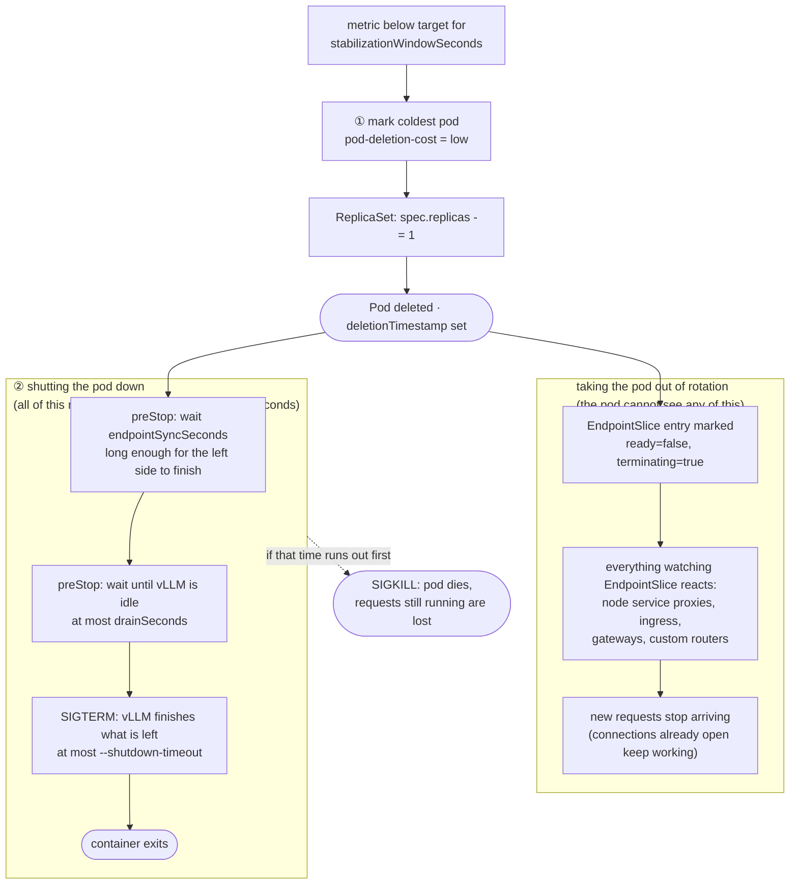

# llmscaleoperator

A Kubernetes operator that autoscales LLM inference workloads (e.g. vLLM) on
LLM-specific signals — KV-cache utilization, queue depth, TPM/capacity load —
rather than CPU/memory. Think of it as an HPA specialized for token-serving.


## Images and releases

| | |
| --- | --- |
| Public image | `4pdosc/llm-operator` (Docker Hub) — the default everywhere in this repo |
| Internal image | `harbor.4pd.io/hardcore-tech/llm-operator` — same build, internal registry |

Both are built from the same `Dockerfile`; only the base-image build args and the
destination registry differ. Tagging `vX.Y.Z` publishes both:
`.github/workflows/release.yml` pushes to Docker Hub, `.gitlab-ci.yml` to harbor.

Both pipelines refuse a tag that does not match `appVersion` in
`dist/chart/Chart.yaml`. The chart leaves `manager.image.tag` empty so it follows
`appVersion`; a tag that disagrees would publish one build and install another.

To run the internal image instead of the public one:

```bash
# Helm
helm install llmscaleoperator ./dist/chart \
  --set manager.image.repository=harbor.4pd.io/hardcore-tech/llm-operator

# Makefile targets
make deploy IMG=harbor.4pd.io/hardcore-tech/llm-operator:0.3.2
```

The Dockerfile's two base images are build args, defaulting to the public
`golang` and `gcr.io/distroless/static`. Point them at a mirror where those
registries are unreachable:

```bash
docker build \
  --build-arg GO_IMAGE=<mirror>/golang:1.26 \
  --build-arg RUNTIME_IMAGE=<mirror>/distroless-static:nonroot .
```

The internal CI passes `harbor.4pd.io/hardcore-tech/golang:1.26` and
`harbor.4pd.io/hardcore-tech/distroless-static:nonroot`, mirrored there because
its runner has no route to docker.io or gcr.io.

## Description

The operator introduces a single CRD, **`LLMScaler`** (`autoscaling.modelsphere.dev`), that points at a scalable workload and drives its replica count from a metrics source.

- **Target** (`spec.targetRef`): any `Deployment`, `StatefulSet`, or `LeaderWorkerSet` (handled generically via the unstructured client).
- **Metric provider** (`spec.metricProvider`): where the scaling signal comes from — `Prometheus` (default) or `Custom`. The two are alternatives, not layers: `Custom` replaces Prometheus outright and there is no fallback between them. See [Custom metric provider](#custom-metric-provider).
- **Metrics** (`spec.metrics`, `Prometheus` provider only): each entry is a **PromQL query** plus a per-replica `target`, evaluated against `spec.serverAddress`. The query **must** return a single aggregated value (e.g. wrap it in `avg(...)`), with label filters baked in — a result vector of more than one series is rejected rather than resolved to an arbitrary sample, so aggregate away every label the source varies on (`backend`, `model`, `route`, `pod`). Instant (`avg(...)`) and range (`avg(avg_over_time(...[1m]))`) queries are both valid — nothing enforces one, it's a trade-off. As a rule of thumb, a short `avg_over_time([1m])` survives a missed scrape and filters single-sample spikes while keeping scale-up responsive, provided you keep the window short (~1m for bursty queue depth, ~2m for slower-moving KV-cache); down-conservatism is better handled by `scaleDown.stabilizationWindowSeconds` than by a long metric window. **Scope the query to this deployment's pods**, not just the model — otherwise multiple deployments serving the same model get averaged together. Filter on `namespace` plus a per-deployment label such as `app` (the chart's ServiceMonitor exposes `app` via `podTargetLabels`; `namespace` is always present, and matters because release names can repeat across namespaces). Example: `query: avg(vllm:kv_cache_usage_perc{namespace="default", app="opt-125m-vllm"})`, `target: "0.8"`. The same applies to `scaleDown.deletionCostQuery`.
- **Headers** (`spec.serverHeaders`): arbitrary headers sent with every metric-fetch request (e.g. `Authorization` for a secured Prometheus or decision server).

### CRD specification

| | |
| --- | --- |
| Group / version | `autoscaling.modelsphere.dev/v1alpha1` |
| Kind | `LLMScaler` (list `LLMScalerList`) |
| Resource | `llmscalers` (singular `llmscaler`) |
| Scope | Namespaced |
| Subresources | `status` |

The target is looked up **in the `LLMScaler`'s own namespace** — `targetRef` has no `namespace` field, so a scaler cannot drive a workload in another namespace.

#### `spec`

| Field | Type | Required | Default | Description |
| --- | --- | --- | --- | --- |
| `targetRef` | object | ✔ | — | Workload to scale. See below. |
| `metricProvider` | string | | `Prometheus` | `Prometheus` or `Custom`. Selects the scaling signal source; see [Custom metric provider](#custom-metric-provider). |
| `customProvider` | object | | — | Decision-server settings. Required when `metricProvider: Custom`, ignored otherwise. See below. |
| `serverAddress` | string | ✔ | — | Metric source endpoint. Under `Prometheus`, the query API (e.g. `http://prometheus-operated.monitoring.svc:9090`) — queries go to `{serverAddress}/api/v1/query`. Under `Custom`, the decision server's base URL. |
| `serverHeaders` | map[string]string | | — | Extra HTTP headers sent with every metric fetch (e.g. `Authorization`). Values are used verbatim. |
| `minReplicas` | int32 | ✔ | — | Lower bound. Minimum `1`. |
| `maxReplicas` | int32 | ✔ | — | Upper bound. Minimum `1`. |
| `metrics` | []object | ✔ under `Prometheus` | — | Metrics driving the replica count; the **largest** recommendation across entries wins. Rejected as empty under `Prometheus`, unused under `Custom`. See below. |
| `syncPeriodSeconds` | int32 | | `15` | Interval between metric evaluations (the `RequeueAfter` that paces each scale step). |
| `retryPeriodSeconds` | int32 | | `10` | Requeue interval used instead of `syncPeriodSeconds` when the target is missing or a sync errors. |
| `scaleDown` | object | | see below | Scale-down damping and cache-aware teardown. |
| `preemption` | object | | — | `enable` (bool), `priorityClass` (string). Accepted by the API but **not implemented** by the controller — setting it does nothing today. |

#### `spec.targetRef`

| Field | Type | Required | Description |
| --- | --- | --- | --- |
| `apiVersion` | string | ✔ | e.g. `apps/v1`, `leaderworkerset.x-k8s.io/v1`. |
| `kind` | string | ✔ | `Deployment`, `StatefulSet`, or `LeaderWorkerSet`. Read and written generically through the unstructured client, so any kind exposing `spec.replicas` plus `status.readyReplicas` works; the rollout guard and cache-aware victim selection are `Deployment`-only. |
| `name` | string | ✔ | Name of the target in the `LLMScaler`'s namespace. |

#### `spec.metrics[]`

| Field | Type | Required | Description |
| --- | --- | --- | --- |
| `name` | string | | Identifier for this metric in logs and events. |
| `query` | string | ✔ | PromQL returning a **single** aggregated, per-replica value — more than one series is an error, not a sample to pick from. See the `spec.metrics` notes above for scoping guidance. |
| `target` | string | ✔ | Desired per-replica value, as a quoted number on the same scale as the query (`"0.8"` against a 0–1 ratio, `"80"` against a 0–100 series). Must be finite and positive; a `%` suffix is rejected rather than guessed at. |

#### `spec.customProvider`

Only read when `metricProvider: Custom`.

| Field | Type | Required | Default | Description |
| --- | --- | --- | --- | --- |
| `serviceId` | string | ✔ | — | The service whose decision to read. Sent as the `serviceId` query parameter **and** matched against `decisions[].serviceId` in the reply. |
| `namespace` | string | | — | Narrows the match to decisions carrying this namespace. Only needed if the server can report the same `serviceId` in more than one — a `serviceId` matching several decisions is an error, not a choice. |
| `path` | string | | `/decisions` | Request path on `serverAddress`. |

#### `spec.scaleDown`

| Field | Type | Default | Description |
| --- | --- | --- | --- |
| `stabilizationWindowSeconds` | int32 | `0` | Hold replicas at the highest recommendation seen within this window. `0` disables it. Scale-up is unaffected. |
| `maxStepReplicas` | int32 | `0` | Maximum replicas removed per scale-down step; `0` means unlimited. Minimum `0`. Bounds the size of a step, not the interval between steps. |
| `behavior` | string | `CacheAware` | `CacheAware` biases deletion toward the coldest pods via `controller.kubernetes.io/pod-deletion-cost`; `None` leaves deletion order to the workload controller. |
| `deletionCostQuery` | string | — | PromQL returning one series per pod, each carrying a `pod` label; the sample value becomes that pod's deletion cost and the lowest is deleted first. Empty falls back to newest-pod-first. Only consulted when `behavior: CacheAware` **and** `metricProvider: Prometheus` — it is PromQL, and a decision server has no query API to run it against. |

#### `status`

| Field | Type | Description |
| --- | --- | --- |
| `currentReplicas` | int32 | The target's **ready** replicas at the last sync — the figure the scaling ratio is computed from, not `spec.replicas`. |
| `desiredReplicas` | int32 | Last recommendation after clamping to min/max and scale-down stabilization, but **before** the `maxStepReplicas` cap. While a step cap is walking the fleet down it therefore reports the destination, not the replica count just written. |
| `conditions` | []metav1.Condition | Declared in the API; the controller does not populate it yet. |

`kubectl get llmscalers` prints `MinReplicas`, `MaxReplicas`, `CurrentReplicas`, `DesiredReplicas`.

#### Example

```yaml
apiVersion: autoscaling.modelsphere.dev/v1alpha1
kind: LLMScaler
metadata:
  name: llmscaler-sample
spec:
  targetRef:
    apiVersion: apps/v1
    kind: Deployment
    name: vllm-opt-125m
  serverAddress: "http://prometheus-operated.monitoring.svc:9090"
  minReplicas: 1
  maxReplicas: 5
  syncPeriodSeconds: 15
  retryPeriodSeconds: 10
  metrics:
    # Scope the query to THIS deployment's pods (not just the model) so multiple
    # deployments serving the same model don't get averaged together.
    - name: kv-cache
      query: 'avg(avg_over_time(vllm:kv_cache_usage_perc{namespace="default", app="vllm-opt-125m"}[2m]))'
      target: "0.8"
  scaleDown:
    stabilizationWindowSeconds: 180
    maxStepReplicas: 1
    behavior: CacheAware
    deletionCostQuery: 'vllm:kv_cache_usage_perc{namespace="default", app="vllm-opt-125m"} * 100'
```

Kept in sync at `config/samples/autoscaling_v1alpha1_llmscaler.yaml`; the generated schema is `config/crd/bases/autoscaling.modelsphere.dev_llmscalers.yaml`.

### Custom metric provider

`metricProvider: Custom` replaces Prometheus with an external **decision server** that has already worked out how many replicas the service should have. Instead of measuring something per replica and dividing by a target, the operator asks a question and is handed the answer:

```
GET {serverAddress}{customProvider.path}?serviceId={customProvider.serviceId}
```

```console
$ curl http://10.98.120.218:80/decisions?serviceId=fallback-modelforge-01
{
  "apiVersion": "llmscaling.inference.x-k8s.io/v1alpha1",
  "decisions": [
    {
      "namespace": "modelforge",
      "serviceId": "fallback-modelforge-01",
      "replicas": {
        "active": 15
      }
    }
  ]
}
```

Only `decisions[].replicas.active` is read; every other field either identifies the decision or is ignored.

- **The count is absolute, not per-replica.** `active: 15` means fifteen replicas — the `ceil(readyReplicas × value / target)` ratio the Prometheus path applies has no counterpart here, and applying one would compound the server's own decision on every sync. `spec.metrics` is not consulted at all (and not required by the CRD) under this provider.
- **The CRD bounds still hold.** The count is clamped to `[minReplicas, maxReplicas]` and then goes through the same `scaleDown.stabilizationWindowSeconds` damping and `maxStepReplicas` pacing as any other recommendation. The server recommends; this operator keeps the rail. A decision of `0` is a real recommendation and clamps up to `minReplicas`.
- **`apiVersion` selects the schema.** The reply says how to read itself, and only `llmscaling.inference.x-k8s.io/v1alpha1` is understood; anything else is refused rather than parsed hopefully, since a later schema is free to reuse `replicas` for something that is not an absolute count.
- **The reply is matched, not trusted.** `serviceId` is sent as a query parameter *and* checked against `decisions[].serviceId`, because what comes back is the server's choice — a decision for a service this scaler did not ask about must not be able to drive it. Exactly one decision must match; **more than one is an error**, the same rule (and the same reasoning) as a multi-series PromQL result. Set `customProvider.namespace` if the server reports the same `serviceId` in several namespaces.
- **A failure holds the fleet, it never reads as zero.** A server that is down, a non-200, an unknown `apiVersion`, no matching decision, or a decision with no `replicas.active` all skip that sync and leave `spec.replicas` where it is — mirroring how an unevaluable PromQL query is handled.
- **`scaleDown.deletionCostQuery` is ignored** under this provider: it is PromQL and `serverAddress` is now a decision server, so victim selection falls back to the newest-pod-first heuristic. The controller logs when it skips it.

```yaml
apiVersion: autoscaling.modelsphere.dev/v1alpha1
kind: LLMScaler
metadata:
  name: llmscaler-custom-provider-sample
spec:
  targetRef:
    apiVersion: apps/v1
    kind: Deployment
    name: fallback-modelforge-01
  metricProvider: Custom
  serverAddress: "http://llm-decision-server.modelforge.svc:80"
  customProvider:
    serviceId: fallback-modelforge-01
    namespace: modelforge
    path: /decisions
  minReplicas: 1
  maxReplicas: 20
  scaleDown:
    stabilizationWindowSeconds: 180
    maxStepReplicas: 1
```

Kept in sync at `config/samples/autoscaling_v1alpha1_llmscaler_customprovider.yaml`.

### Scaling algorithm

Standard HPA math, evaluated every `spec.syncPeriodSeconds`:

```
desired = ceil(readyReplicas × currentValue / targetValue)   # max across metrics
desired = clamp(desired, minReplicas, maxReplicas)
```

Under `metricProvider: Custom` only the first line is replaced — `desired` is the decision server's `replicas.active`, and everything from the clamp onward is identical.

- Computed off the target's **ready** replicas (actual serving capacity), so it does not compound on pods that were just requested but haven't started.
- **A metric that cannot be measured is skipped, not read as zero.** A query that errors, returns an empty vector, returns more than one series, or returns `NaN`/`Inf` contributes nothing to that sync; when *every* metric is skipped the replica count is held where it is. This matters when mixing a metric that drives scale-up with a guardrail: `histogram_quantile` over a histogram with no observations in the window returns `NaN`, and were that read as 0 a guardrail could recommend `minReplicas` on its own whenever the primary metric happened to fail. For the same reason, do not append `or vector(0)` to a guardrail — reserve it for the metric that drives scale-up, where a genuine zero should scale in.
- The controller watches the `LLMScaler` with `GenerationChangedPredicate`, so its own status writes don't re-trigger reconciliation. Periodic evaluation is driven solely by `RequeueAfter(syncPeriod)`, which paces each scale step.
- **Rollout guard**: while a Deployment target is mid-rollout (spec not yet observed, or not all replicas on the new template), scaling is deferred. New pods start with cold KV caches that both distort the metric average and would be mis-picked as scale-down victims, so the controller waits for the rollout to settle before acting.
- **Scale Down**
    - **Scale-down stabilization** (`spec.scaleDown.stabilizationWindowSeconds`, 0 = off): replicas are held at the highest recommendation seen within the window, so a brief metric dip doesn't shrink the fleet.
    - **Scale-down step cap** (`spec.scaleDown.maxStepReplicas`, 0 = unlimited): at most this many replicas are removed per scale-down action, so a collapsed metric walks the fleet down (`10 → 8 → 6 → …` at `maxStepReplicas: 2`) instead of bursting from N straight to `minReplicas`. This is the knob for "don't throw away all the warm caches at once". Note it bounds the *size* of a step, not the interval between steps — that is the settle guard's job (see below).
- **Scale-up is immediate** — no scale-up stabilization window, so capacity is added as soon as the metric warrants it (the fast-up / slow-down shape). It stays bounded because `desired` is computed off *ready* replicas (no compounding) and clamped to `maxReplicas`. A scale-up rate cap for slow-starting pods is intentionally not implemented — vLLM pods are heavy, so a `1 → maxReplicas` jump can start several at once and briefly overshoot before they serve; add a step cap only if that overshoot actually hurts you.

### Cache-aware scale-down

Deleting a pod with a hot KV cache throws away a warm cache someone paid for. `spec.scaleDown.behavior`, default `CacheAware`; `None` to turn off. Two steps:

1. **Preferred victim selection** — choose the coldest pod to delete.
2. **Graceful drain** — let that pod finish what it is doing before it goes, and force it to stop if it takes too long.

Deleting a pod starts two things at the same time, and the pod only controls the one on the right:



Neither side waits for the other. The kubelet starts `preStop` without knowing whether the pod has been taken out of the load balancer yet, and the pod has no way to ask — so it just waits `endpointSyncSeconds` first and lets the left side catch up. That is the one number you may need to tune.

#### 1. Preferred victim selection

Before lowering `spec.replicas`, the controller sets a low `controller.kubernetes.io/pod-deletion-cost` on the pods being removed, so the ReplicaSet deletes those first.

- Set **only when scaling down**, and **only on the pods being removed** — never on every metric check, because Kubernetes warns that frequent updates to this annotation overload the apiserver.
- It is a **hint, not a guarantee**: unready pods are still deleted first. It also works on **Deployment/ReplicaSet only** — StatefulSet and LWS delete by ordinal and ignore it.
- It only edits an annotation on the running pod, so it does **not** restart anything. (Editing the Deployment's pod *template* would start a rollout; this does not.)
- Two ways to decide which pod is coldest:
  - **Ask Prometheus** — `spec.scaleDown.deletionCostQuery` is a query returning one result per pod (with a `pod` label), run against `spec.serverAddress`. Each pod's value becomes its cost, and the lowest goes first. E.g. `vllm:kv_cache_usage_perc{namespace="default"} * 100` keeps the fuller caches.
  - **Guess** — with no query set, the newest pod is assumed to have the coldest cache. Also what `metricProvider: Custom` uses, since the query is PromQL and there is no Prometheus to run it against.

#### 2. Graceful drain

A pod that is being deleted keeps serving until it is out of the load balancer and its remaining requests are done. `test/charts/vllm-mock` sets up the three steps on the right-hand side of the diagram:

- **Wait `endpointSyncSeconds`** — always waits the full time, even on an idle pod, because there is nothing to check. Set it to however long whatever routes traffic to this pod needs to notice it is going away: Cilium suggests ~1s for a ClusterIP Service, ~10s if an external load balancer is in front.
- **Wait for vLLM to go idle** — watches `vllm:num_requests_running` and `vllm:num_requests_waiting` and stops as soon as both are zero, waiting at most `drainSeconds`. An idle pod shuts down right away instead of waiting the whole time. If the check fails, it assumes the pod is still busy and keeps waiting.
- **`--shutdown-timeout`** (vLLM ≥ 0.18.0) — once SIGTERM arrives, vLLM's default of `0` **kills** any request still running. Setting it above zero lets those requests finish instead.

All three share the same `terminationGracePeriodSeconds` budget. When it runs out the kubelet stops waiting and sends SIGKILL, and any request still running dies with the pod — the one outcome all of this exists to avoid. It can land in any of the three steps, not just the last one, so the chart refuses to render if `endpointSyncSeconds + drainSeconds + shutdownTimeout` adds up to more than the budget.

### TODO

- [ ] **switch operator scale write to Server-Side Apply**. Move `spec.replicas` writes from the current client-side `r.Update` (PUT) to client.Apply/SSA with a stable, explicit field manager and only `spec.replicas` in the apply set, so the operator owns that field outright regardless of Helm. Recorded with the current-state details and the reason (ownership is presently incidental, so Helm could still thrash if it re-asserts the field).

### Testing the scale operation

Tiny models (e.g. `facebook/opt-125m`) never fill their KV cache enough to trip a real threshold. The `vllm-mock` chart ships an optional `metricsMock` (`--set metricsMock.enabled=true`) that returns a fixed metric value, so the scaler can be driven to scale up/down deterministically. See `test/charts/vllm-mock/values.yaml`.

