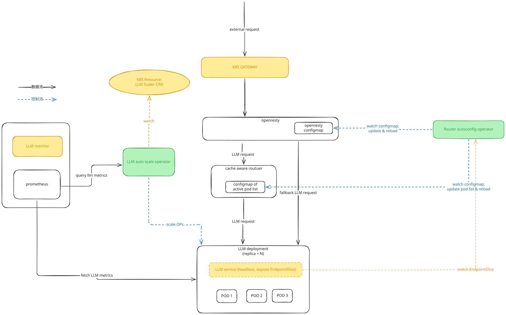

# llmscaleoperator

A Kubernetes operator that autoscales LLM inference workloads (e.g. vLLM) on
LLM-specific signals — KV-cache utilization, queue depth, TPM/capacity load —
rather than CPU/memory. Think of it as an HPA specialized for token-serving.



## Description

The operator introduces a single CRD, **`LLMScaler`** (`autoscaling.4pd.io`),
that points at a scalable workload and drives its replica count from a metrics
source.

- **Target** (`spec.targetRef`): any `Deployment`, `StatefulSet`, or
  `LeaderWorkerSet` (handled generically via the unstructured client).
- **Metrics** (`spec.metrics`): each entry is a **PromQL instant query** plus a
  per-replica `target`, evaluated against `spec.serverAddress`. The query should
  return a single averaged value (e.g. wrap it in `avg(...)`), and label filters
  are baked into the query itself. **Scope the query to this deployment's pods**,
  not just the model — otherwise multiple deployments serving the same model are
  averaged together. Filter on `namespace` plus a per-deployment label such as
  `app` (the chart's ServiceMonitor exposes `app` via `podTargetLabels`;
  `namespace` is always present). `namespace` matters because release names can
  repeat across namespaces. Example:
  `query: avg(vllm:kv_cache_usage_perc{namespace="default", app="opt-125m-vllm"})`,
  `target: "0.8"`. The same applies to `scaleDown.deletionCostQuery`.
- **Headers** (`spec.serverHeaders`): arbitrary headers sent with every
  metric-fetch request (e.g. `Authorization` for a secured Prometheus).

### Scaling algorithm

Standard HPA math, evaluated every `spec.syncPeriodSeconds`:

```
desired = ceil(readyReplicas × currentValue / targetValue)   # max across metrics
desired = clamp(desired, minReplicas, maxReplicas)
```

- Computed off the target's **ready** replicas (actual serving capacity), so it
  does not compound on pods that were just requested but haven't started.
- The controller watches the `LLMScaler` with `GenerationChangedPredicate`, so
  its own status writes don't re-trigger reconciliation. Periodic evaluation is
  driven solely by `RequeueAfter(syncPeriod)`, which paces each scale step.
- **Rollout guard**: while a Deployment target is mid-rollout (spec not yet
  observed, or not all replicas on the new template), scaling is deferred. New
  pods start with cold KV caches that both distort the metric average and would
  be mis-picked as scale-down victims, so the controller waits for the rollout
  to settle before acting.
- **Scale-down stabilization** (`spec.scaleDown.stabilizationWindowSeconds`,
  0 = off): replicas are held at the highest recommendation seen within the
  window, so a brief metric dip doesn't shrink the fleet. Scale-up is immediate.

### Cache-aware scale-down

On scale-down, which pod goes matters: evicting a pod with a hot KV cache wastes
warm capacity. Two mechanisms combine (`spec.scaleDown.behavior`, default
`CacheAware`; set `None` to opt out):

1. **Preferred victim selection** — before lowering `spec.replicas`, the
   controller sets a low `controller.kubernetes.io/pod-deletion-cost` on exactly
   the pods being removed (coldest-cache first), so the ReplicaSet deletes those
   first. This is done **only at scale-down time**, on **only the sacrificed
   pods** — never as a per-metric update — because Kubernetes warns that
   frequent, metric-driven updates to this annotation overload the apiserver. It
   is **best-effort** (unready pods still go first, etc.) and applies only to
   **Deployment/ReplicaSet** targets; StatefulSet/LWS scale-down is ordinal-based
   and ignores the hint.
2. **Graceful drain** — a `preStop` hook plus `terminationGracePeriodSeconds`
   (see `test/charts/vllm-mock`) keeps a terminating pod serving until it is
   removed from Service endpoints and in-flight requests drain, so scale-down is
   safe *regardless* of which pod the ReplicaSet ultimately picks. Victim
   selection is therefore an optimization, not a correctness requirement.

Coldest-pod ranking has two modes:

- **PromQL-defined cost** — set `spec.scaleDown.deletionCostQuery` to an instant
  query that returns one series per pod (carrying a `pod` label). At scale-down
  time the controller evaluates it against `spec.serverAddress` and writes each
  pod's `pod-deletion-cost` from the sample value (lower = deleted first). E.g.
  `vllm:kv_cache_usage_perc{namespace="default"} * 100` keeps warmer pods.
- **Heuristic fallback** — when no query is set, newest pod = coldest cache, and
  only the sacrificed pods are marked.

> Patching a live Pod's `pod-deletion-cost` annotation is an in-place metadata
> write — it does **not** restart the pod. (Changing the Deployment's pod
> *template* would trigger a rollout; changing the annotation on the running Pod
> does not.)

### Testing the scale operation

Tiny models (e.g. `facebook/opt-125m`) never fill their KV cache enough to trip
a real threshold. The `vllm-mock` chart ships an optional `metricsMock`
(`--set metricsMock.enabled=true`) that returns a fixed metric value, so the
scaler can be driven to scale up/down deterministically. See
`test/charts/vllm-mock/values.yaml`.

## Getting Started

### Prerequisites
- go version v1.24.6+
- docker version 17.03+.
- kubectl version v1.11.3+.
- Access to a Kubernetes v1.11.3+ cluster.

### To Deploy on the cluster
**Build and push your image to the location specified by `IMG`:**

```sh
make docker-build docker-push IMG=<some-registry>/llmscaleoperator:tag
```

**NOTE:** This image ought to be published in the personal registry you specified.
And it is required to have access to pull the image from the working environment.
Make sure you have the proper permission to the registry if the above commands don’t work.

**Install the CRDs into the cluster:**

```sh
make install
```

**Deploy the Manager to the cluster with the image specified by `IMG`:**

```sh
make deploy IMG=<some-registry>/llmscaleoperator:tag
```

> **NOTE**: If you encounter RBAC errors, you may need to grant yourself cluster-admin
privileges or be logged in as admin.

**Create instances of your solution**
You can apply the samples (examples) from the config/sample:

```sh
kubectl apply -k config/samples/
```

>**NOTE**: Ensure that the samples has default values to test it out.

### To Uninstall
**Delete the instances (CRs) from the cluster:**

```sh
kubectl delete -k config/samples/
```

**Delete the APIs(CRDs) from the cluster:**

```sh
make uninstall
```

**UnDeploy the controller from the cluster:**

```sh
make undeploy
```

## Project Distribution

Following the options to release and provide this solution to the users.

### By providing a bundle with all YAML files

1. Build the installer for the image built and published in the registry:

```sh
make build-installer IMG=<some-registry>/llmscaleoperator:tag
```

**NOTE:** The makefile target mentioned above generates an 'install.yaml'
file in the dist directory. This file contains all the resources built
with Kustomize, which are necessary to install this project without its
dependencies.

2. Using the installer

Users can just run 'kubectl apply -f <URL for YAML BUNDLE>' to install
the project, i.e.:

```sh
kubectl apply -f https://raw.githubusercontent.com/<org>/llmscaleoperator/<tag or branch>/dist/install.yaml
```

### By providing a Helm Chart

1. Build the chart using the optional helm plugin

```sh
kubebuilder edit --plugins=helm/v2-alpha
```

2. See that a chart was generated under 'dist/chart', and users
can obtain this solution from there.

**NOTE:** If you change the project, you need to update the Helm Chart
using the same command above to sync the latest changes. Furthermore,
if you create webhooks, you need to use the above command with
the '--force' flag and manually ensure that any custom configuration
previously added to 'dist/chart/values.yaml' or 'dist/chart/manager/manager.yaml'
is manually re-applied afterwards.

## Contributing
// TODO(user): Add detailed information on how you would like others to contribute to this project

**NOTE:** Run `make help` for more information on all potential `make` targets

More information can be found via the [Kubebuilder Documentation](https://book.kubebuilder.io/introduction.html)

## License

Copyright 2026.

Licensed under the Apache License, Version 2.0 (the "License");
you may not use this file except in compliance with the License.
You may obtain a copy of the License at

    http://www.apache.org/licenses/LICENSE-2.0

Unless required by applicable law or agreed to in writing, software
distributed under the License is distributed on an "AS IS" BASIS,
WITHOUT WARRANTIES OR CONDITIONS OF ANY KIND, either express or implied.
See the License for the specific language governing permissions and
limitations under the License.

